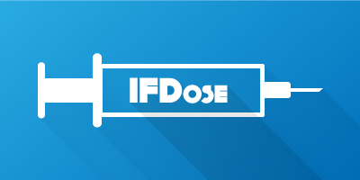

<p align="center"></p>
# Plateforme Web


## Configuration

### fichier .env

#### base de données

Modifier les parametres de connexion au base de données :

```
DB_CONNECTION=mysql
DB_HOST=127.0.0.1
DB_PORT=3306
DB_DATABASE=database
DB_USERNAME=username
DB_PASSWORD=password
```
#### envoie d'email

Pour utiliser gmail il faut aller au lien et mettre 'Allow less secure apps' => ON :

[https://myaccount.google.com/security?pli=1#connectedapps](https://myaccount.google.com/security?pli=1#connectedapps)

Apres modifier les champs dans le fichier .env :

```
MAIL_DRIVER=smtp
MAIL_HOST=smtp.gmail.com
MAIL_PORT=587
MAIL_USERNAME=email_d'envoyant
MAIL_FROM_ADDRESS=email_d'envoyant
MAIL_PASSWORD=password
MAIL_ENCRYPTION=tls
MAIL_NAME=nom_d'envoyant (ex: IFDose)
MAIL_FROM_NAME=nom_d'envoyant
```

### Preparation
#### commandes a executer avant le lancement

```
composer install
php artisan key:generate
php artisan config:clear
php artisan optimize --force
php artisan config:cache
php artisan route:cache
```

Commandes pour la population de la base de données
```
php artisan migrate
php artisan db:seed
```

## Lancement

```
php artisan server --host=addr_host --port=port
```
# recette
